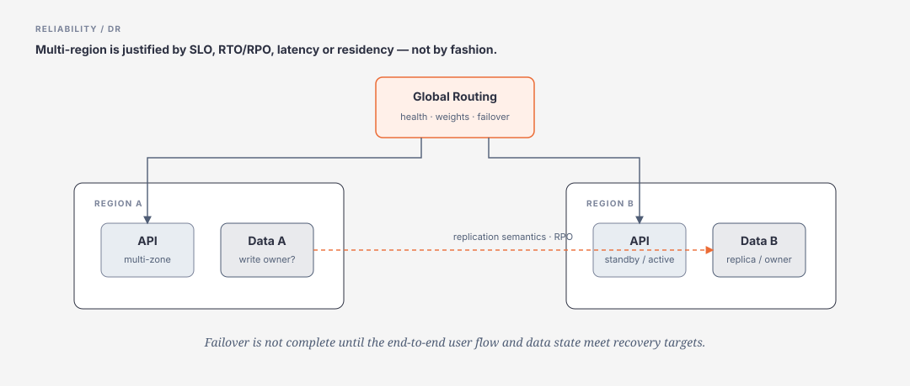

# Availability, Multi-region, DR, Security & Cost

> [← System Design overview](README.md) · [References](references.md)

## Hiểu trong 5 phút

Không bắt đầu bằng:

```text
Need high availability
→ active-active multi-region
```

Bắt đầu bằng:

```text
critical flow
→ SLO
→ failure modes
→ RTO/RPO
→ redundancy level
→ recovery strategy
→ operational capability
→ cost
```



Microsoft mission-critical guidance cũng nhấn mạnh không nên mặc định active-active multi-region nếu requirement chưa đủ mạnh để justify complexity/cost.

---

# 1. Availability vs Resilience vs Recoverability

## Availability

User có dùng được critical flow trong promised quality window không?

## Resilience

System có chịu được fault và vẫn tiếp tục cung cấp acceptable service không?

## Recoverability

Nếu failure vượt khả năng resilience, system có restore trong RTO/RPO không?

Ba khái niệm liên quan nhưng không giống nhau.

---

# 2. SLO theo user journey

Không chỉ:

```text
API service uptime = 99.99%
```

Nếu checkout phụ thuộc:

```text
API
Payment
Inventory
Order DB
```

user journey availability phụ thuộc toàn flow.

Design SLO:

```text
99.95% checkout attempts reach a correct terminal/trackable state
P95 API-owned latency < 700 ms
unknown payment outcomes are reconciled < 2 min
```

Correctness cũng là reliability.

---

# 3. Composite availability intuition

Nếu critical path có 3 independent dependencies, mỗi cái 99.9%, rough serial availability:

```text
0.999 × 0.999 × 0.999 ≈ 99.70%
```

Đây chỉ là approximation; failures không luôn independent.

Lesson:

```text
adding synchronous critical dependencies can lower journey availability
```

---

# 4. Single point of failure — SPOF

Examples:

```text
one app instance
one database with no failover
one DNS/control point
one network path
one secret store region
one manual operator account
one queue namespace
```

Không phải mọi SPOF đều cần remove. Cần map tới business impact/SLO.

---

# 5. Redundancy levels

Progression:

```text
single instance
→ multiple instances same zone
→ multi-zone
→ secondary region
→ multi-region active/passive
→ multi-region active/active
```

Mỗi step tăng:

```text
availability potential

AND

cost
coordination
consistency complexity
deployment complexity
testing burden
```

---

# 6. Availability Zone vs Region

Useful mental model:

```text
Zone failure
→ same region, isolated datacenter/fault domain class

Region failure
→ larger geographic/control/data-plane event
```

Multi-zone thường là first HA step trước multi-region nếu platform/workload supports it.

Multi-region is usually DR + global latency/residency problem, not merely “more HA”.

---

# 7. Active/Passive

```text
Region A ACTIVE
Region B STANDBY
```

Benefits:

```text
simpler write ownership
less conflict
lower cost than full active-active
```

Costs:

```text
failover time
standby freshness/capacity
DNS/global routing convergence
recovery runbook
```

Need answer:

```text
warm or cold standby?
replication lag?
who decides failover?
can failover be reversed safely?
```

---

# 8. Active/Active

```text
Users
 ↓ global routing
Region A ⇄ Region B
```

Benefits:

```text
regional latency
capacity utilization
region failure tolerance potential
```

Hard parts:

```text
write conflicts
cross-region consistency
session/data placement
traffic shifting
partial regional degradation
schema/deployment compatibility
cost
```

Nếu source of truth vẫn single-region synchronous, “active-active API” có thể chỉ là cosmetic.

---

# 9. Deployment Stamp / Cell pattern

Instead of one giant global cluster:

```text
Global Router
  ├─ Stamp A
  ├─ Stamp B
  └─ Stamp C
```

Each stamp:

```text
ingress
compute
cache
queue/data slice
observability
```

Benefits:

```text
blast-radius isolation
repeatable scale unit
incremental rollout
regional/tenant placement
```

Trade-off:

```text
routing metadata
data placement
cross-stamp query
operational count
```

---

# 10. RTO/RPO drive architecture

Example A:

```text
RTO = 24h
RPO = 4h
```

Backup/restore may be enough.

Example B:

```text
RTO = 5 min
RPO = 1 min
```

Likely need:

```text
continuous replication
pre-provisioned recovery capacity
automated failover/runbook
frequent drills
```

Do not buy active-active when backup/restore meets business target.

---

# 11. Backup is not DR until restore is tested

Need evidence:

```text
backup created
restore succeeded
restore time measured
data integrity verified
application reconnect verified
RTO/RPO checked
```

A green “backup job succeeded” is not recovery proof.

---

# 12. Failure Mode Analysis

Template:

| Failure | Impact | Detection | Mitigation | Recovery | Evidence |
|---|---|---|---|---|---|
| API pod/node loss | reduced capacity | health/LB | replicas | auto replace | chaos test |
| DB primary loss | writes stop | DB health | HA replica | failover | planned drill |
| queue outage | async work stops | publish errors | retry/buffer | provider restore | outage lab |
| region loss | regional flow unavailable | synthetic checks | secondary region | failover | DR drill |
| bad deploy | correctness/error spike | canary SLI | rollback | previous artifact | release test |

System Design review phải có table tương tự, không chỉ happy-path architecture.

---

# 13. Graceful degradation

Prioritize business capability:

```text
Tier 0
checkout / payment state

Tier 1
order status

Tier 2
recommendation
search suggestions
analytics
```

Failure policy:

```text
recommendations down
≠ checkout down
```

Design optional dependencies so their failures do not enter critical path unnecessarily.

---

# 14. Security là System Design dimension

Security không phải “thêm JWT sau”.

Map:

```text
identity
trust boundaries
authorization
data classification
secrets
network exposure
audit
abuse/rate limit
encryption
supply chain
```

For each data flow ask:

```text
Who can call?
Which identity?
Which resource scope?
What data crosses boundary?
What if request is malicious?
What is logged?
```

---

# 15. Threat boundary example

```text
Internet
   ↓ untrusted
Edge / Gateway
   ↓ authenticated identity
Application
   ↓ service identity
Database
```

Do not use internal network location as the only authorization control.

---

# 16. Multi-tenant isolation

Levels:

```text
identity isolation
authorization isolation
cache-key isolation
data partition isolation
resource quota isolation
observability/audit isolation
```

A tenantId field in query is not sufficient if one code path can omit it.

Prefer structural/policy enforcement where possible.

---

# 17. Cost model

System Design without cost is incomplete.

Estimate:

```text
compute
managed database
replicas
cache
queue/stream
object storage
network egress
CDN
observability
backup
DR idle capacity
AI tokens/embeddings
human operations
```

The last item is often largest hidden cost.

---

# 18. Cost vs reliability

Example:

```text
99.9% → single-region multi-zone
99.99% → maybe stronger redundancy/operations
99.999% → often much higher architecture + organizational cost
```

Do not promise nines that incident response, change process and dependency SLOs cannot support.

---

# 19. Observability cost

Telemetry can become material:

```text
1M RPS
× verbose request logs
× 30-day retention
```

→ huge storage/indexing bill.

Design:

```text
structured low-cardinality metrics
sampling strategy
PII redaction
retention tiers
trace sampling with error/critical-flow bias
```

“Log everything” is not observability strategy.

---

# 20. Operational complexity budget

Compare:

Option A:

```text
single region
managed DB
simple queue
```

Option B:

```text
3 regions active-active
sharded DB
streaming platform
service mesh
custom failover
```

Option B may have higher theoretical availability but lower real reliability if team cannot operate it safely.

Architect must ask:

```text
Can this team test, deploy, debug and recover this system at 3 AM?
```

---

# 21. Deployment safety

Reliability failures often come from change, not hardware.

Use:

```text
immutable artifact
canary
blue/green where justified
feature flag
schema compatibility
health/SLO gate
automated rollback criteria
```

Multi-region deploy should avoid all regions changing simultaneously when blast radius matters.

---

# 22. Schema evolution across regions/services

Use compatibility window:

```text
old producer + old consumer
new producer + old consumer
old producer + new consumer
new producer + new consumer
```

Expand → migrate → contract.

Region failover to an older incompatible version is a real DR failure mode.

---

# 23. DR Runbook

Minimum:

```text
trigger criteria
incident owner
traffic shift steps
data state verification
secret/config validation
queue/backlog handling
read/write mode decisions
customer communication
failback criteria
post-recovery verification
```

Automate where safe, but keep human-understandable runbook.

---

# 24. DR drill

Scenario:

```text
primary region unavailable
```

Measure:

```text
detection time
operator decision time
traffic failover time
data availability
queue recovery
error rate during transition
full user-flow recovery
```

Pass/fail against RTO/RPO.

Microsoft reliability testing guidance stresses end-to-end tests against SLO/RTO/RPO rather than assuming component redundancy equals workload recovery.

---

# 25. Multi-region checklist

Before choosing multi-region:

```text
[ ] Business needs the RTO/RPO/latency/residency benefit
[ ] Data replication semantics understood
[ ] Write ownership/conflict strategy explicit
[ ] Global routing failure behavior understood
[ ] Dependencies exist in both regions or degrade safely
[ ] Secrets/config/artifacts replicated
[ ] Observability works during region loss
[ ] Backlog/replay strategy exists
[ ] Failover tested
[ ] Failback tested
[ ] Cost accepted
```

If many boxes are unknown, architecture is not ready.

---

# 26. Architect decision example

Requirement:

```text
B2B admin portal
business hours only
RTO 4h
RPO 1h
99.9% SLO
single-country users
```

Reject:

```text
active-active 3 regions
```

Likely simpler:

```text
single region
multi-zone managed services
backups + tested restore
secondary-region IaC/runbook if impact justifies
```

Contrast mission-critical payment flow:

```text
24/7
RTO < 5 min
RPO near zero
large outage revenue impact
```

Now stronger regional redundancy may be justified.

---

# Exit Criteria

Bạn phải có thể:

- distinguish availability/resilience/recoverability;
- set SLO/RTO/RPO from business criticality;
- compare multi-zone, active/passive, active/active;
- explain composite dependency risk;
- create failure mode analysis;
- design graceful degradation;
- include security/trust boundaries in system design;
- estimate architecture/operations cost;
- design and test DR/failback rather than only backup;
- reject over-engineered multi-region when requirements do not justify it.
