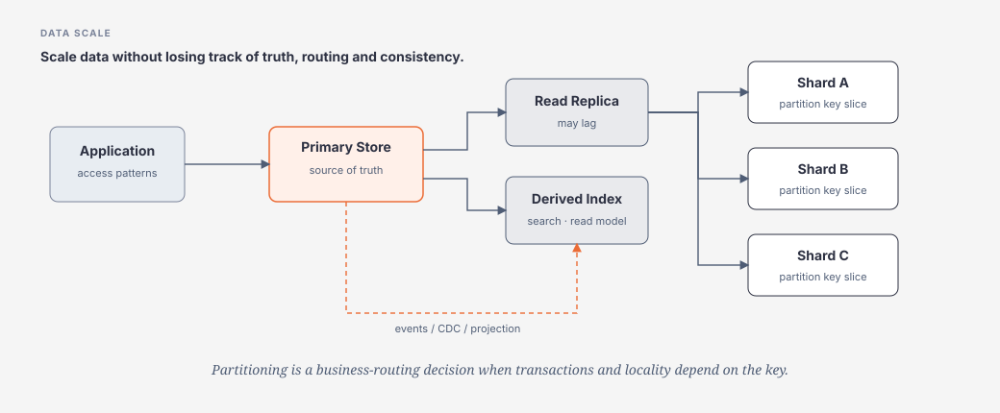

# Data, Replication, Partitioning & Consistency

> [← System Design overview](README.md) · [References](references.md)

## Hiểu trong 5 phút

Database choice không bắt đầu bằng:

```text
SQL vs NoSQL?
```

Mà bắt đầu bằng:

```text
What is the source of truth?
What are the critical access patterns?
What must be transactional together?
How much data / throughput?
How stale may reads be?
What is the partition key?
What happens when one partition is hot or unavailable?
```



---

# 1. Source of truth

Mỗi business fact cần một owner rõ.

Ví dụ:

```text
Order status      → Order store
Payment outcome   → Payment provider/service
Inventory stock   → Inventory store
Search document   → derived index, NOT source of truth
Redis cache       → acceleration, NOT source of truth by default
```

Nếu không biết source of truth, reconciliation và recovery sẽ mơ hồ.

---

# 2. Access patterns trước schema/database product

Liệt kê:

```text
Get order by id
List orders by customer + createdAt
Find pending payments older than 5 min
Update order state atomically
Search products by full text
Aggregate daily revenue
```

Mỗi access pattern có shape khác:

```text
point lookup
range scan
transactional update
full-text search
analytics scan
```

Không có một store luôn tối ưu cho tất cả.

---

# 3. Relational database khi nào phù hợp

Strong fit:

```text
transactions
relationships
constraints
ad hoc query
well-understood schema
financial/business correctness
```

Scale first with:

```text
query shape
indexes
connection pooling
projection
batching
read model
vertical capacity
```

trước khi nhảy thẳng sang sharding.

---

# 4. NoSQL không phải “database để scale” chung chung

NoSQL families giải các pressure khác nhau:

```text
Key-value
→ fast lookup by key

Document
→ aggregate/document-shaped data

Wide-column
→ huge partitioned write/read workloads

Graph
→ relationship traversal

Search engine
→ inverted index / relevance / full-text
```

Architect question:

```text
Which access pattern becomes materially simpler/faster?
What consistency/query/operational capability do we give up?
```

---

# 5. Replication

Mental model:

```text
Primary / Leader
      │
      ├── Replica A
      └── Replica B
```

Potential benefits:

```text
read scale
redundancy
failover
geo-local reads
backup/recovery options
```

Trade-offs:

```text
replication lag
failover complexity
read-after-write inconsistency
write conflict depending on model
more storage/network cost
```

---

# 6. Read replica stale-data example

Request 1:

```text
POST change email
→ primary COMMIT
```

Immediately:

```text
GET profile
→ read replica
→ old email
```

Nếu user flow yêu cầu read-your-write, options:

```text
route critical read to primary
session consistency/token if platform supports
delay/refresh UX
accept eventual consistency explicitly
```

Không thể chỉ nói “replica improves scale” mà bỏ qua consistency semantics.

---

# 7. Partitioning vs Sharding

Khái niệm thường overlap, nhưng useful mental model:

```text
Partitioning
= divide data/work into subsets

Sharding
= horizontal partitioning across independent storage nodes/databases
```

Ví dụ:

```text
Tenant A,C,E → Shard 1
Tenant B,D,F → Shard 2
```

Microsoft Sharding pattern nhấn mạnh shard key là quyết định trung tâm vì nó điều khiển data placement, load balance và cross-shard operations.

---

# 8. Shard key

Một shard key tốt thường cần:

```text
stable
high enough cardinality
balanced traffic/data
supports common routing
minimizes cross-shard transaction/query
```

Bad:

```text
partition by country
```

nếu 80% users ở một country.

Bad:

```text
partition by created month
```

nếu mọi writes luôn rơi vào current month → hot shard.

---

# 9. Sharding strategies

## Range

```text
A-F → shard 1
G-M → shard 2
N-Z → shard 3
```

Good:

```text
range query locality
simple mental model
```

Risk:

```text
hot ranges
rebalancing/split complexity
```

## Hash

```text
hash(customerId) → shard
```

Good:

```text
more even distribution
```

Risk:

```text
range query harder
resharding can move lots of data
```

## Directory / Lookup

```text
tenantId → shard mapping table
```

Good:

```text
flexible placement
move noisy tenants
```

Risk:

```text
routing metadata becomes critical state
```

## Geography

```text
EU user → EU shard
US user → US shard
```

Good:

```text
latency / residency
```

Risk:

```text
uneven load
cross-region query
regulatory movement constraints
```

---

# 10. C# shard routing example

Simple hash routing mental model:

```csharp
public sealed class ShardRouter
{
    private readonly string[] _connectionStrings;

    public ShardRouter(string[] connectionStrings)
        => _connectionStrings = connectionStrings;

    public string GetShard(Guid tenantId)
    {
        uint hash = BitConverter.ToUInt32(tenantId.ToByteArray(), 0);
        int index = (int)(hash % (uint)_connectionStrings.Length);
        return _connectionStrings[index];
    }
}
```

Đây **không phải production resharding solution**.

Nó minh họa một vấn đề:

```text
hash % N
```

khi N thay đổi có thể remap rất nhiều keys. Production design cần strategy migration/consistent hashing/directory tùy store.

---

# 11. Cross-shard transaction

Giả sử:

```text
Account A → shard 1
Account B → shard 2
transfer A → B
```

Transaction local không còn đủ.

Options:

```text
choose partition key so transaction stays local
avoid cross-shard invariant
saga/compensation
workflow + reconciliation
distributed transaction only if platform/requirements justify
```

Một shard key là **business correctness decision**, không chỉ performance detail.

---

# 12. Consistency models — practical view

## Strong consistency

Sau acknowledged write, read thấy latest value theo model của store.

Useful:

```text
inventory invariant
financial ledger mutation
unique ownership
```

Cost may include:

```text
coordination
latency
availability trade-offs during partitions/failures
```

## Eventual consistency

Replicas/views converge over time.

Useful:

```text
search index
analytics
notification delivery status
feed fanout
cached catalog
```

But need explicit user behavior:

```text
may show stale data for X seconds
reconciliation exists
version/sequence protects old events
```

---

# 13. CAP — đừng dùng như slogan

Không viết:

```text
MongoDB is AP.
SQL is CP.
```

CAP concerns behavior **during network partition** in a distributed data system.

More useful questions:

```text
If nodes cannot communicate, do we reject/limit writes or accept divergence?
What does client observe?
How are conflicts resolved?
How long can stale data persist?
```

System design needs concrete semantics, not product labels.

---

# 14. Quorum mental model

Một replicated store có thể use concepts như:

```text
N = replica count
W = write acknowledgements
R = read replicas consulted
```

Design trade-off depends on product/model. Không tự suy ra strong consistency chỉ từ `R + W > N` nếu implementation/conflict/version semantics khác.

Học principle, verify provider documentation.

---

# 15. Denormalization

Denormalization trades write/update complexity for read shape.

Example read model:

```json
{
  "orderId": "123",
  "customerName": "Duyet",
  "total": 1500000,
  "items": 4,
  "paymentStatus": "PAID"
}
```

May duplicate facts owned elsewhere.

Need:

```text
event/update pipeline
versioning
rebuild strategy
staleness expectation
source of truth
```

Denormalized view is not “bad normalization”; it is deliberate read optimization if ownership is clear.

---

# 16. Materialized View / Search Index

Architecture:

```text
Transactional Store
      ↓ events / CDC
Projection Worker
      ↓
Read Model / Search Index
```

Good for:

```text
complex queries
search
aggregation
cross-domain read composition
```

Failure questions:

```text
projection lags?
event missing?
replay?
index schema migration?
delete propagation?
```

---

# 17. Hot partition

Suppose partition key = `celebrityId` in social feed.

One celebrity gets 1M requests/minute.

Overall hash distribution might be fine, but one logical key dominates.

Mitigations depend on operation:

```text
read replication/cache
key salting for write aggregation
fanout strategy
precompute
separate heavy tenant
```

Do not blindly “add shards” if all load targets same shard key.

---

# 18. Consistent hashing — why it exists

Naive:

```text
node = hash(key) % N
```

N changes → many keys remap.

Consistent hashing aims to reduce key movement when nodes join/leave.

Useful for:

```text
distributed cache
partition routing
storage rings
```

But virtual nodes, replication and hotspot mitigation still matter.

---

# 19. Data lifecycle

System Design must include:

```text
retention
delete
archive
backup
restore
legal hold
PII classification
encryption
schema evolution
```

“Store forever” is usually not a free or safe default.

---

# 20. Multi-tenant partitioning

Choices:

```text
shared DB/shared schema
shared DB/separate schema
DB per tenant
shard groups of tenants
```

Trade-offs:

```text
isolation
cost
operational count
noisy neighbor
migration
backup/restore per tenant
compliance
```

Large tenants may need placement different from small tenants.

---

# 21. Data decision worksheet

```text
Entity / fact:
Owner:
Source of truth:
Critical invariants:
Primary reads:
Primary writes:
Transaction boundary:
Read staleness allowed:
Peak read RPS:
Peak write RPS:
Storage growth:
Partition key candidate:
Cross-partition operations:
Backup/restore target:
Retention/delete:
```

---

# 22. Failure scenarios

## Replica lag spikes

```text
primary healthy
replica 30s behind
```

What user flows break?

## One shard unavailable

```text
5% tenants fail
95% healthy
```

Does routing isolate failure or does global dependency cascade?

## Resharding partial

Old and new mapping overlap.

Need:

```text
migration state
read/write routing rules
verification
rollback/forward strategy
```

## Search index lost

Can rebuild from source of truth/event history?

If not, search index is secretly critical source state.

---

# 23. Architect trade-off table

| Requirement | Likely starting point | Scale evolution |
|---|---|---|
| transactional CRUD | relational DB | tune/index/replica |
| huge point lookups | key-value/document | partition/replicate |
| full-text | search index | sharded index |
| analytics | OLAP/read store | columnar/lake/warehouse |
| global reads | replica/cache/CDN | regional placement |
| extreme write scale | partitioned store | shard/hot-key strategy |

Không chọn specialized store khi SQL vẫn đáp ứng NFR với thấp hơn operational cost.

---

# Failure Lab

Thiết kế tenant database:

```text
100k tenants
20 very large tenants
80% traffic from top 5%
```

Thử 3 shard keys:

```text
tenantId hash
region
tenant tier + tenantId
```

Với mỗi option ghi:

```text
load distribution
cross-shard queries
residency
migration complexity
failure blast radius
```

Sau đó inject một shard outage và mô tả user impact.

---

# Exit Criteria

Bạn phải có thể:

- chọn source of truth và phân biệt derived data;
- thiết kế từ access pattern thay vì product preference;
- giải thích replication lag/read-after-write;
- chọn và critique shard key;
- so sánh range/hash/directory/geographic sharding;
- nhận diện hot partition;
- giải thích strong vs eventual consistency bằng user-visible behavior;
- phân tích cross-shard transaction;
- đưa ra migration/rebuild/recovery path cho derived stores.
