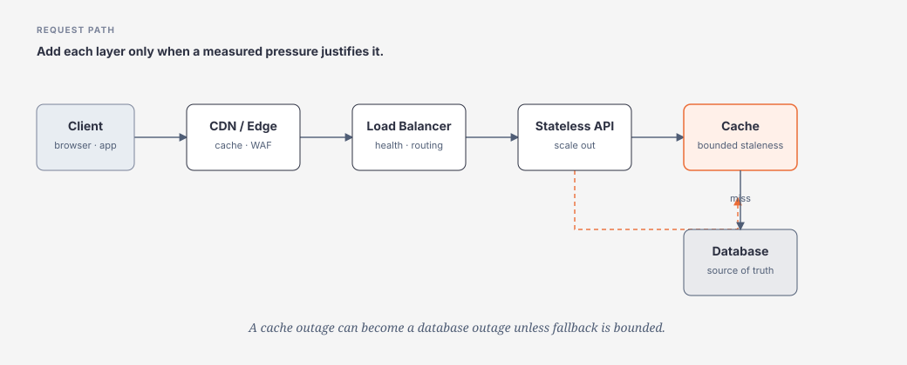

# Traffic, Load Balancing, CDN & Cache

> [← System Design overview](README.md) · [References](references.md)

## Hiểu trong 5 phút

Một request path đơn giản:

```text
Client
  ↓
API
  ↓
Database
```

chỉ nên được mở rộng khi workload tạo pressure:

```text
global/static traffic
→ CDN / Edge

single application instance saturated
→ Load Balancer + stateless instances

repeated expensive reads
→ Cache

slow/non-interactive work
→ Queue + Worker

single database capacity exhausted
→ replica / partition / shard / specialized store
```



---

# 1. Scale up vs Scale out

## Vertical scaling — scale up

```text
4 CPU → 16 CPU
16 GB → 64 GB RAM
```

Ưu điểm:

```text
simple
few moving parts
strong local consistency
low operational complexity
```

Giới hạn:

```text
hardware/service tier ceiling
larger failure blast radius
cost curve
maintenance/failover constraints
```

## Horizontal scaling — scale out

```text
1 instance
→ 4 instances
→ 20 instances
```

Ưu điểm:

```text
elasticity
redundancy
parallel capacity
smaller unit failure
```

Nhưng yêu cầu:

```text
stateless/externally persisted session
load balancing
shared-state discipline
idempotency
coordination minimization
```

Microsoft Architecture guidance khuyến nghị thiết kế application có thể scale horizontally và tránh instance stickiness khi không thật sự cần.

---

# 2. Stateless application tier

Bad:

```text
Request 1
→ App instance A
→ local memory session

Request 2
→ App instance B
→ session missing
```

Better:

```text
Client request
     ↓
Load Balancer
  ┌──┼──┐
  ↓  ↓  ↓
 A   B   C   stateless API
      ↓
 shared durable state / distributed cache where justified
```

Không có nghĩa app không có memory; nghĩa **correctness không phụ thuộc một process cụ thể sống mãi**.

---

# 3. Load Balancer — vấn đề nó giải quyết

Load balancer phân phối traffic tới healthy backend instances.

Questions:

```text
Layer 4 or Layer 7?
regional or global?
health probe semantics?
sticky session required?
connection draining?
TLS termination?
weighted/canary routing?
```

Load balancer không tự làm application scalable nếu bottleneck là:

```text
single database
single hot partition
shared lock
external provider quota
serialized critical section
```

---

# 4. Health checks

## Liveness

```text
Is process alive enough to restart if broken?
```

## Readiness

```text
Should this instance receive traffic now?
```

Bad readiness:

```text
return 200 if process is running
```

trong khi app chưa load critical config hoặc đang draining.

Bad dependency strategy:

```text
readiness requires every optional dependency healthy
```

→ một analytics service outage có thể remove toàn bộ API instances khỏi LB.

Design readiness theo **critical serving path**.

---

# 5. CDN / Edge

CDN phù hợp với:

```text
static assets
public cacheable responses
large geographically distributed audience
origin bandwidth reduction
latency reduction
```

Mental model:

```text
User Vietnam
  ↓
Nearby Edge
  ↓ cache hit
response

cache miss
  ↓
Origin
```

Questions:

```text
What is cache key?
What varies by Authorization/Cookie/Language?
How long may data be stale?
How is invalidation done?
Can personalized data leak across users?
```

CDN là **data replication**, nên luôn có consistency/security questions.

---

# 6. Cache — không chỉ “faster DB”

Cache trade-off:

```text
lower latency
lower origin load
higher throughput

BUT

stale data
invalidation complexity
memory cost
hot keys
stampede
new failure mode
```

System Design question không phải:

```text
Should we use Redis?
```

Mà là:

```text
Which reads are expensive and repeated?
What staleness is acceptable?
What happens on cache miss/outage?
What is the source of truth?
```

---

# 7. Cache-Aside

Read path:

```text
GET key
  ↓
Cache hit? ── yes → return
  │
  no
  ↓
Database
  ↓
Cache SET TTL
  ↓
return
```

Write path thường:

```text
update source of truth
  ↓
invalidate cache
```

C# conceptual example:

```csharp
public async Task<Product?> GetProductAsync(
    Guid id,
    CancellationToken cancellationToken)
{
    string key = $"product:{id}";

    Product? cached = await cache.GetAsync<Product>(key, cancellationToken);
    if (cached is not null)
        return cached;

    Product? product = await repository.GetAsync(id, cancellationToken);
    if (product is null)
        return null;

    await cache.SetAsync(
        key,
        product,
        TimeSpan.FromSeconds(30),
        cancellationToken);

    return product;
}
```

Missing production concerns:

```text
cache stampede
negative caching
TTL jitter
serialization versioning
tenant-aware key
cache outage
stale replica read
```

---

# 8. Cache stampede

1000 concurrent requests miss same key:

```text
1000 misses
→ 1000 DB queries
→ DB overload
```

Mitigations:

```text
single-flight / request coalescing
short lock around refresh
stale-while-revalidate
TTL jitter
pre-warming for known hot keys
bounded fallback concurrency
```

Không dùng distributed lock nếu local coalescing đủ giải quyết scope.

---

# 9. Hot key

Nếu 1 key chiếm 30% traffic:

```text
hash distribution looks balanced overall
BUT
one cache node / shard burns
```

Options:

```text
replicate hot read data
local L1 cache
CDN/edge
key fanout when semantics permit
application-specific precompute
```

Hotspot là workload property, không phải chỉ database problem.

---

# 10. Multi-level caching

```text
Browser cache
    ↓
CDN
    ↓
Application local cache
    ↓
Distributed cache
    ↓
Database
```

Mỗi layer thêm:

```text
cache key
TTL
invalidation
staleness
observability
privacy risk
```

Nhiều cache layers không mặc định tốt hơn.

---

# 11. HTTP cache vs application cache

HTTP cache:

```text
Cache-Control
ETag
If-None-Match
304 Not Modified
```

Application cache:

```text
object/query/result cached in app/Redis/etc.
```

Nếu client/CDN có thể dùng validators/freshness thì đừng bắt mọi request vào backend chỉ để Redis trả lại cùng payload.

---

# 12. Load shedding

Khi overload, mục tiêu không phải luôn nhận hết request.

Better:

```text
reject bounded excess
→ preserve critical traffic
→ recover quickly
```

thay vì:

```text
accept everything
→ queues grow everywhere
→ timeout
→ retries
→ collapse
```

Mechanisms:

```text
rate limit
concurrency limit
queue bound
priority
admission control
circuit breaker
```

---

# 13. Back-of-envelope request-path design

Requirement:

```text
GET /articles/{id}
peak 50k RPS
P95 < 100 ms
article changes few times/day
public content
```

Start:

```text
Client → API → SQL
```

Pressure:

```text
50k repeated reads
same content globally
staleness seconds/minutes acceptable
```

Likely evolution:

```text
Client
  ↓
CDN
  ↓ miss
Load Balancer
  ↓
Stateless API
  ↓
Cache
  ↓ miss
SQL
```

Architect must still define:

```text
invalidations
cache key/version
origin protection
hot article handling
fallback behavior
```

---

# 14. Load Balancer algorithm — concept

Common concepts:

```text
round robin
least connections
weighted routing
consistent hashing / affinity when required
health-based routing
```

Không cần tự implement load balancer để hiểu trade-off.

Affinity có thể hữu ích cho stateful protocol nhưng giảm flexibility scale-out.

---

# 15. Failure scenarios

## Cache unavailable

Naive fallback:

```text
all traffic → DB
```

Cache outage có thể biến thành DB outage.

Safer design:

```text
cache unavailable
→ bounded DB fallback
→ shed non-critical traffic
→ stale response if acceptable
```

## Load balancer marks all instances unhealthy

Questions:

```text
bad readiness release?
shared dependency outage?
probe timeout too strict?
configuration rollout?
```

## CDN stale content

Need:

```text
versioned asset URLs
cache purge strategy
max-age policy
rollback-safe cache key
```

---

# 16. Observability

Measure by layer:

```text
Edge
- cache hit ratio
- origin request rate
- edge latency

Load Balancer
- healthy backends
- connection/request rate
- 4xx/5xx

Application
- RPS
- P50/P95/P99
- in-flight
- saturation

Cache
- hit ratio
- latency
- evictions
- memory
- hot keys

Database
- query latency
- connections
- CPU/IO
- lock waits
```

Một cache hit ratio 99% vẫn có thể tệ nếu 1% miss = 5k DB RPS mà DB chịu tối đa 1k.

---

# 17. Architect decision table

| Pressure | Simplest first option | Later options |
|---|---|---|
| app CPU saturated | scale up / optimize | scale out |
| repeated public content | HTTP cache | CDN |
| repeated expensive DB read | query/index tuning | cache-aside |
| one instance failure unacceptable | multiple instances + LB | multi-zone |
| origin bandwidth huge | compression/cache | CDN |
| hot key | local/replicated cache | partition-aware strategies |
| overload | bound/reject | queue/prioritize/scale |

---

# Failure Lab

1. baseline API with direct DB reads;
2. load until DB becomes first bottleneck;
3. add cache-aside;
4. rerun same workload;
5. kill cache;
6. observe DB fallback;
7. add bounded fallback/concurrency limit;
8. record P95, DB RPS, hit ratio and failure behavior.

Expected lesson:

```text
cache improves steady-state
but changes failure architecture
```

---

# Exit Criteria

Bạn phải giải thích được:

- scale-up vs scale-out và synchronization bottleneck;
- stateless serving tier;
- regional/global load balancing questions;
- CDN/cache key/invalidation/staleness;
- cache-aside, stampede, hot key;
- why cache outage can overload DB;
- why load shedding can improve availability;
- khi nào **không cần** cache/CDN/load balancer phức tạp.
