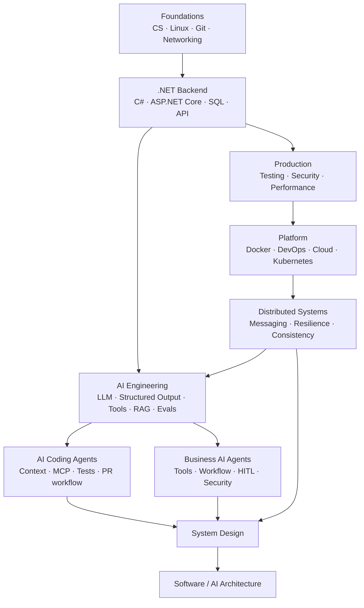

# AI-Enabled Software Architect Roadmap

> **Đọc tiếng Việt · giữ thuật ngữ English · học bằng code + failure experiment + architecture reasoning.**

Nếu tài liệu trước đây làm bạn thấy quá dài, hãy bắt đầu bằng [Cách đọc tài liệu này](00-roadmap/how-to-read.md). Không cần đọc từ đầu đến cuối.

## Chọn điểm bắt đầu

### Tôi muốn củng cố .NET Backend

Đi theo:

```text
C#/.NET → Backend → SQL → API Design → ASP.NET Core
```

Bắt đầu tại [C#/.NET Runtime](03-dotnet/README.md).

### Tôi đã làm Backend và muốn học Production/Architect

Đi theo:

```text
Testing/Security/Performance
→ Docker/DevOps/Kubernetes
→ Distributed Systems
→ System Design
→ Architecture
```

Xem [Master Roadmap](00-roadmap/master-roadmap.md).

### Tôi muốn học AI Engineering ngay

Bắt đầu tại **[AI Engineering cho .NET](19-ai-engineering/README.md)**.

Bạn sẽ có code cho:

- `IChatClient` và provider abstraction;
- structured output;
- tool calling;
- authorization/idempotency cho AI tools;
- RAG retrieval boundary;
- evaluation/regression gate;
- AI observability.

### Tôi dùng Codex / Copilot / Claude Code hoặc coding agents nhiều

Bắt đầu tại **[AI Coding Agents](21-ai-coding-agents/README.md)**.

Bạn sẽ học theo workflow thật:

```text
Task
→ inspect repo
→ plan
→ edit
→ build/test
→ inspect diff
→ security checks
→ PR
→ human review
```

và có ví dụ `AGENTS.md`, shell discovery, MCP/context boundary, CI YAML, regression test và agent evaluation.

---

## Roadmap trong một hình



## Cách học mỗi chapter

```text
1. Hiểu trong 5 phút
2. Chạy code
3. Vẽ mental model
4. Cố tình làm hỏng
5. Quan sát logs/tests/trace
6. Đọc internals
7. Trả lời trade-offs
```

Xem chi tiết: [How to Read](00-roadmap/how-to-read.md).

## Những trang code-heavy mới

1. [AI Engineering cho .NET](19-ai-engineering/README.md)
2. [Structured Output và Tool Calling](19-ai-engineering/structured-output-and-tool-calling.md)
3. [RAG, Evaluation và Observability](19-ai-engineering/rag-evaluation-and-observability.md)
4. [AI Coding Agents](21-ai-coding-agents/README.md)
5. [Repository Context, MCP và Instructions](21-ai-coding-agents/repository-context-mcp-and-instructions.md)
6. [Safe Agentic Coding Workflow](21-ai-coding-agents/safe-agentic-coding-workflow.md)

## Quality model

| Level | Bạn phải làm được |
| --- | --- |
| L0 | Nói được công nghệ giải quyết vấn đề gì |
| L1 | Vẽ được mental model |
| L2 | Viết/chạy được code cơ bản |
| L3 | Debug failure, security, performance |
| L4 | Giải thích behavior bằng internals |
| L5 | Chọn hoặc loại giải pháp bằng requirements + trade-offs |

Một chapter P0/P1 không được gọi là `Content v1` nếu chỉ có prose. Tối thiểu phải có **minimal code/config + production example + failure experiment + verification** khi chủ đề cho phép.

## Trạng thái hiện tại

- Module 01–04: quality reference hiện tại.
- Module 05–15: structure/coverage đã có; đang cần deep rewrite và thêm code.
- **Module 19 AI Engineering: code-first v1 đã bắt đầu.**
- **Module 21 AI Coding Agents: code-first v1 đã bắt đầu.**
- Module 16–18, 20, 22–26: tiếp tục triển khai theo dependency và nhu cầu thực tế.

## Đích đến

**AI-enabled Software Architect** không cần thuộc mọi tool. Bạn cần có khả năng trả lời bằng evidence:

- requirement/NFR là gì;
- boundary nằm ở đâu;
- data/AI/tool nào được phép truy cập gì;
- failure/retry/idempotency ra sao;
- latency/cost/quality được đo thế nào;
- khi nào cần agent, khi nào deterministic workflow đơn giản hơn;
- coding agent được sandbox, test và review như thế nào;
- kiến trúc sẽ thay đổi thế nào ở 10x/100x scale.
