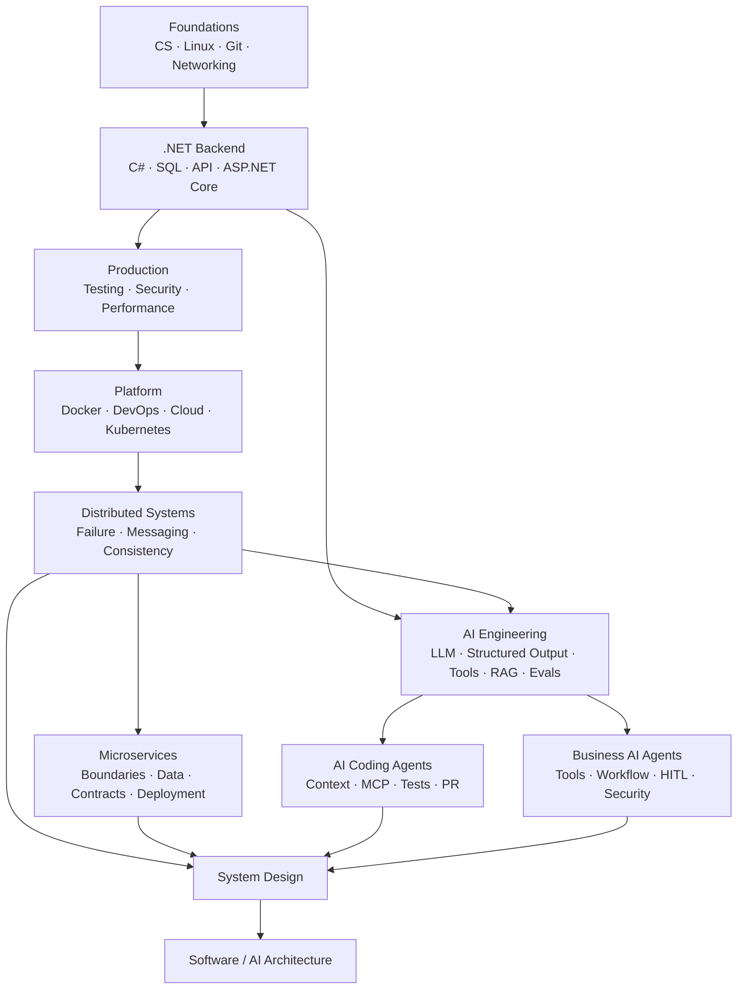

# AI-Enabled Software Architect Roadmap

> **Tiếng Việt để hiểu nhanh · thuật ngữ English giữ nguyên · học bằng code + failure experiment + architecture reasoning.**

Nếu tài liệu dài, bắt đầu bằng [Cách đọc tài liệu này](00-roadmap/how-to-read.md). Bạn không cần đọc từ đầu tới cuối.

## Chọn điểm bắt đầu

### .NET Backend

```text
C#/.NET → Backend → SQL → API Design → ASP.NET Core
```

Bắt đầu: [C#/.NET Runtime](03-dotnet/README.md).

### Production / Platform / Distributed / Microservices

```text
Docker
→ Kubernetes
→ Distributed Systems
→ Microservices Architecture
```

Bắt đầu:

- [Docker](12-docker/README.md)
- [Kubernetes](15-kubernetes/README.md)
- [Distributed Systems](17-distributed-systems/README.md)
- **[Microservices Architecture](18-microservices-architecture/README.md)**

Microservices module có case study checkout thực tế:

```text
Duplicate checkout
→ Idempotency
→ Inventory reservation
→ Payment attempt
→ timeout = UNKNOWN
→ PENDING_PAYMENT
→ reconciliation
→ Saga compensation
→ Outbox / Inbox / Dedup
```

### AI Engineering

Bắt đầu: **[AI Engineering cho .NET](19-ai-engineering/README.md)**.

Có code cho:

- `IChatClient` và provider abstraction;
- structured output;
- tool calling;
- authorization/idempotency cho AI tools;
- RAG retrieval boundary;
- evaluation/regression gate;
- AI observability.

### AI Coding Agents

Bắt đầu: **[AI Coding Agents](21-ai-coding-agents/README.md)**.

Workflow:

```text
Task
→ inspect repo
→ plan
→ scoped edit
→ build/test
→ inspect diff
→ security checks
→ PR
→ human review
```

---

## Roadmap trong một hình



---

## Cách học mỗi chapter

```text
1. Hiểu trong 5 phút
2. Chạy code/config
3. Vẽ mental model
4. Cố tình làm hỏng
5. Quan sát test/log/trace/plan
6. Đọc internals
7. Trả lời trade-offs
```

---

## Code-heavy pages nên đọc

### SQL

1. [SQL Overview](05-sql/README.md)
2. [Transactions / Isolation / Concurrency](05-sql/transactions-isolation-and-concurrency.md)
3. [Indexes / Execution Plans](05-sql/indexes-execution-plans-and-operations.md)
4. [EF Core → SQL → Execution Plan](05-sql/ef-core-query-shape-and-sql.md)

### ASP.NET Core

5. [ASP.NET Core Overview](07-aspnet-core/README.md)
6. [Pipeline / Hosting / Configuration](07-aspnet-core/pipeline-hosting-and-configuration.md)
7. [Resilience / Security / Middleware](07-aspnet-core/resilience-security-and-middleware.md)
8. [Deployment / OTel / Operations](07-aspnet-core/deployment-observability-and-operations.md)

### Docker / Kubernetes

9. [Docker Overview](12-docker/README.md)
10. [Docker Runtime / Network / Storage](12-docker/runtime-networking-storage-and-resources.md)
11. [Kubernetes Overview](15-kubernetes/README.md)
12. [Kubernetes Architecture / Reconciliation](15-kubernetes/cluster-architecture-and-reconciliation.md)
13. [Kubernetes Workloads / Network / Storage](15-kubernetes/workloads-networking-and-storage.md)
14. [Kubernetes Security / Operations](15-kubernetes/kubernetes-security-observability-and-operations.md)

### Distributed Systems

15. [Distributed Systems Overview](17-distributed-systems/README.md)
16. [Partial Failure / Retry / Idempotency](17-distributed-systems/partial-failure-timeouts-retries-and-idempotency.md)
17. [Messaging / Outbox / Inbox / Dedup](17-distributed-systems/messaging-outbox-inbox-and-dedup.md)
18. [Consistency / Ordering / Saga / Backpressure](17-distributed-systems/consistency-ordering-saga-and-backpressure.md)

### Microservices Architecture

19. [Microservices Overview](18-microservices-architecture/README.md)
20. [Service Boundaries / Data Ownership / Contracts](18-microservices-architecture/service-boundaries-data-ownership-and-contracts.md)
21. [Checkout Saga / Unknown Outcome / Reconciliation](18-microservices-architecture/checkout-saga-unknown-outcome-and-reconciliation.md)
22. [Communication / API Gateway / Discovery / Deployment](18-microservices-architecture/communication-gateway-discovery-and-deployment.md)
23. [Testing / Observability / Migration](18-microservices-architecture/testing-observability-and-migration.md)

### AI

24. [AI Engineering cho .NET](19-ai-engineering/README.md)
25. [Structured Output / Tool Calling](19-ai-engineering/structured-output-and-tool-calling.md)
26. [RAG / Evaluation / Observability](19-ai-engineering/rag-evaluation-and-observability.md)
27. [AI Coding Agents](21-ai-coding-agents/README.md)
28. [Repository Context / MCP / Instructions](21-ai-coding-agents/repository-context-mcp-and-instructions.md)
29. [Safe Agentic Coding Workflow](21-ai-coding-agents/safe-agentic-coding-workflow.md)

---

## Microservices: điều cần nhớ

```text
Microservices ≠ nhiều project/container
```

Một service phải có:

```text
business boundary
+ owned data
+ explicit API/event contract
+ independent lifecycle
+ observability/SLO/runbook
```

Nếu service share DB/domain model và phải deploy đồng thời, bạn có thể đang xây **distributed monolith**.

---

## Quality model

| Level | Bạn phải làm được |
| --- | --- |
| L0 | nói được công nghệ giải quyết vấn đề gì |
| L1 | vẽ được mental model |
| L2 | viết/chạy được code cơ bản |
| L3 | debug failure, security, performance |
| L4 | giải thích behavior bằng internals |
| L5 | chọn/loại giải pháp bằng requirements + trade-offs |

Một chapter P0/P1 implementation-heavy không được gọi là deep content nếu chỉ có prose. Tối thiểu cần **code/config + production example + failure experiment + verification** khi chủ đề cho phép.

## Trạng thái hiện tại

- Module 01–04: quality reference.
- **Module 05 SQL: code-first deep rewrite v1.**
- **Module 07 ASP.NET Core: code-first deep rewrite v1.**
- **Module 12 Docker: code-first deep rewrite v1.**
- **Module 15 Kubernetes: code-first deep rewrite v1.**
- **Module 17 Distributed Systems: code-first v1.**
- **Module 18 Microservices Architecture: code-first v1.**
- **Module 19 AI Engineering: code-first v1.**
- **AI Coding Agents: code-first v1.**
- Các module còn lại tiếp tục được rewrite/triển khai theo cùng quality gate.

## Đích đến

**AI-enabled Software Architect** không cần thuộc mọi tool. Bạn cần trả lời bằng evidence:

- requirement/NFR là gì;
- boundary và data ownership nằm ở đâu;
- transaction/consistency/retry/idempotency ra sao;
- Saga/compensation/reconciliation hoạt động thế nào;
- service contract có evolve/deploy độc lập được không;
- queue/backpressure/order/failure recovery thế nào;
- data/AI/tool được phép truy cập gì;
- latency/cost/quality được đo ra sao;
- khi nào dùng microservices, khi nào Modular Monolith tốt hơn;
- kiến trúc đổi ra sao ở 10x/100x scale.
