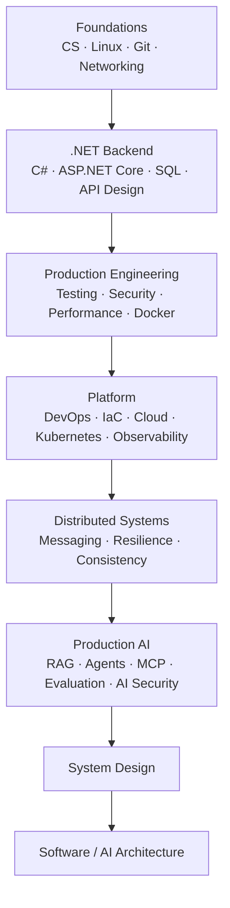

# AI-Enabled Software Architect Knowledge Roadmap

Lộ trình thực chiến bằng tiếng Việt, giữ nguyên thuật ngữ kỹ thuật tiếng Anh: từ C#/.NET Backend đến Distributed Systems, AI Engineering, System Design và Software Architecture.

## Cách sử dụng

- Bắt đầu ở [Master Roadmap](00-roadmap/master-roadmap.md) để hiểu toàn bộ dependency và priority P0–P3.
- Dùng [Learning Path](00-roadmap/learning-path.md) để học theo phase và phase gate.
- Tự đánh giá bằng [Skills Matrix](00-roadmap/skills-matrix.md); không coi “đã đọc” là evidence.
- Kiểm tra [Technology Baseline](00-roadmap/technology-baseline.md) trước khi viết code/config phụ thuộc phiên bản.
- Dùng [Source Policy](00-roadmap/source-policy.md) để phân biệt official docs, Context7 và nguồn tham khảo.

## Quality model

Mỗi chủ đề đi qua sáu lớp:

| Level | Năng lực |
| --- | --- |
| L0 — Overview | Biết công nghệ giải quyết vấn đề gì |
| L1 — Fundamentals | Hiểu primitive và mental model |
| L2 — Working Knowledge | Implement được use case điển hình |
| L3 — Production Engineering | Xử lý failure, security, performance và operations |
| L4 — Internals | Giải thích được behavior từ cơ chế bên trong |
| L5 — Architecture | Chọn/loại giải pháp bằng requirements và trade-offs |

Một chapter chỉ được coi là `Content v1` khi các phần substantial có nội dung **topic-specific**, không chỉ có đủ heading. Generic prose có thể copy sang công nghệ khác phải được xem là chưa hoàn thành deep content.

## Trạng thái nội dung

- Module 01–04: dùng làm quality reference hiện tại.
- Module 05–15: đã có structure và coverage ban đầu; cần deep-review theo topic trước khi coi là hoàn thành L4/L5.
- Module 16–26: triển khai sau khi depth của platform/backend core đạt quality gate.

Xem chi tiết tại [Roadmap Overview](00-roadmap/README.md).

## Đích đến

**AI-enabled Software Architect** có thể trả lời bằng evidence:

- Requirement và NFR thực sự là gì?
- Boundary nào thuộc application, data, platform và AI?
- Failure mode nào phải xử lý và recovery ra sao?
- Security/trust boundary thay đổi thế nào?
- Scale 10x/100x làm thay đổi quyết định nào?
- Chi phí vận hành và complexity có xứng đáng không?
- Khi nào nên giữ monolith, khi nào mới nên phân tán hệ thống?
- Agent/RAG/MCP được evaluate, authorize, audit và rollback thế nào?
